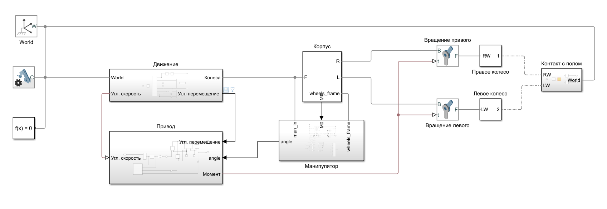
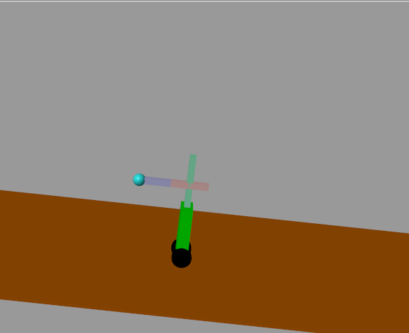

# ProjectMatLab
Учебный проект по предмету Иммитационное Моделирование Робототехнических систем

Цель: симуляция гипотетического робота, являющимся самобалансирующимся основанием, и установленным на нем манипулятором, который не был предварительно подготовлен для данных условий работы.

Задача: создать балансирующего робота

Подзадачи: 
Получение данных об отклонении от изначального положения и угла наклона корпуса основания;
Получение данных об развиваемых скоростях и ускорениях основания;
Получение данных об развиваемых силах и моментах во время работы робота (относительно основания);
Сравнение графиков требуемого и действительного положений манипулятора;
Понять пригодность совмещения самобалансирующегося основания и манипулятора без изменения конструкции.

